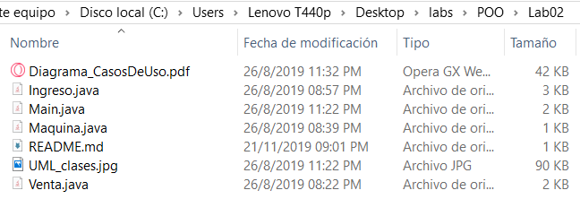
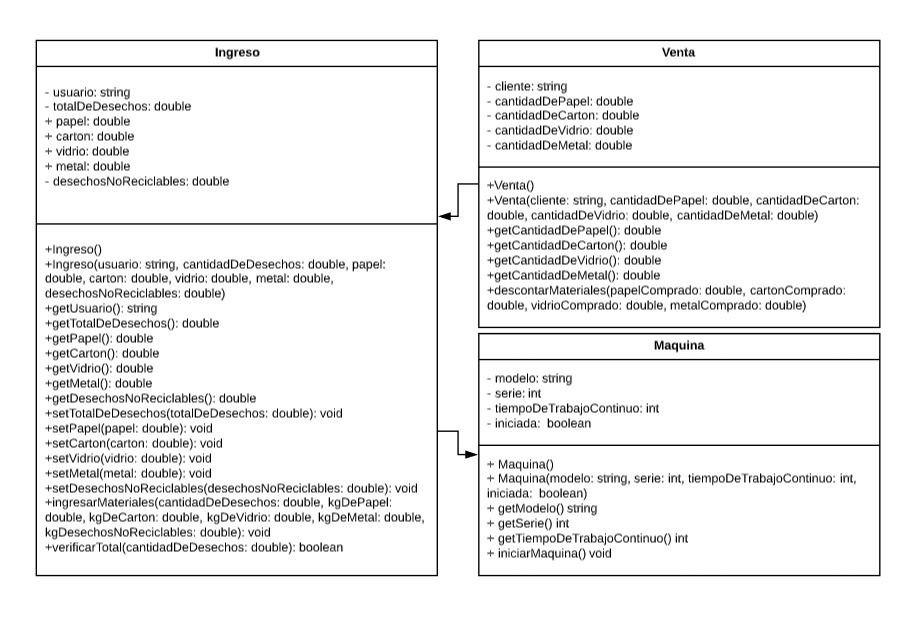

# POO_Lab2
POO - Lab02

## Enunciado:
```
- Escriba en conjunto con sus compañeros una descripción detallada del sistema que les fue asignado el primer día de clases, indique de forma clara las operaciones que se pueden realizar (casos de uso) y quienes las llevan a cabo (actores).
- Realice un diagrama de casos de uso.
- Escriba la descripción detallada de al menos tres casos de uso.
- Con el formato UML, diagrame tres clases con sus respectivos métodos y atributos.
- Traduzca los diagramas de clases a clases de Java.
- Cree un programa con una función main que permita inicializar los objetos de sus clases y realizar pruebas.
```

## Aspectos Administrativos
```
1. Límite para la entrega de la asignación: Martes 27 de agosto a las 3pm.
2. Plataforma de revisión presentación en clase.
```
## Fecha de modificacion de los archivos de este lab



## Diagrama de Clases


## Diagrama de Casos de Uso en Diagrama_CasosDeUso.pdf


