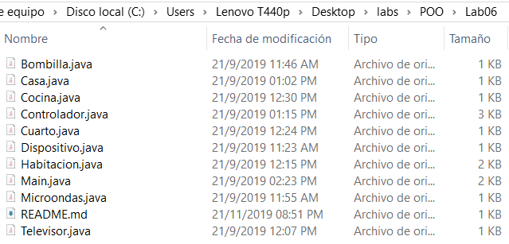

# POO_Lab6
Curso POO  - Lab 6  
Enunciado


## Enunciado:
```
En este laboratorio diseñaremos un controlador de dispositivos inteligentes, que permite accionar sobre los dispositivos de una casa inteligente.
1. La casa tendrá n cantidad de habitaciones, con m dispositivos inteligentes.
2. Cada dispositivo podrá ser apagado o encendido desde el controlador.
3. Algunos dispositivos tendrán comportamientos particulares, por ejemplo, en una lavadora se pueden seleccionar varios ciclos de lavado, o se puede reiniciar una computadora.
4. El controlador permite también apagar o encender, todos los dispositivos de una habitación en particular.
```

## Aspectos Administrativos
```
1. Límite para la entrega de la asignación: Martes 24 de septiembre a las 3pm.
2. Plataforma de revisión repositorio de código.
```
## Fecha de modificacion de los archivos de este lab

