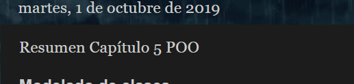

# POO_Lab8
POO - Lab08

## Enunciado:
```
1. Realice una lectura del capítulo 5 del libro Object-Oriented Software Engineering, acerca de modelado de clases. Encuentre disponible el pdf en el TEC
Digital/Documentos/Apuntes.
2. Resuma su lectura empleando sus propias palabras, incluya todas las secciones del capítulo.
```

## Aspectos Administrativos
```
1. Límite para la entrega de la asignación: Martes 1 de octubre a las 3pm.
2. Plataforma de revisión: Blog
```
## Fecha de modificacion de los archivos de este lab


## Link del blog
https://www.kevince.ga/2019/10/resumen-capitulo-poo.html
