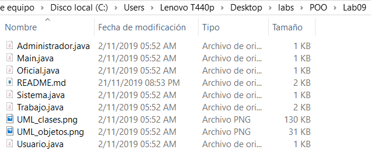
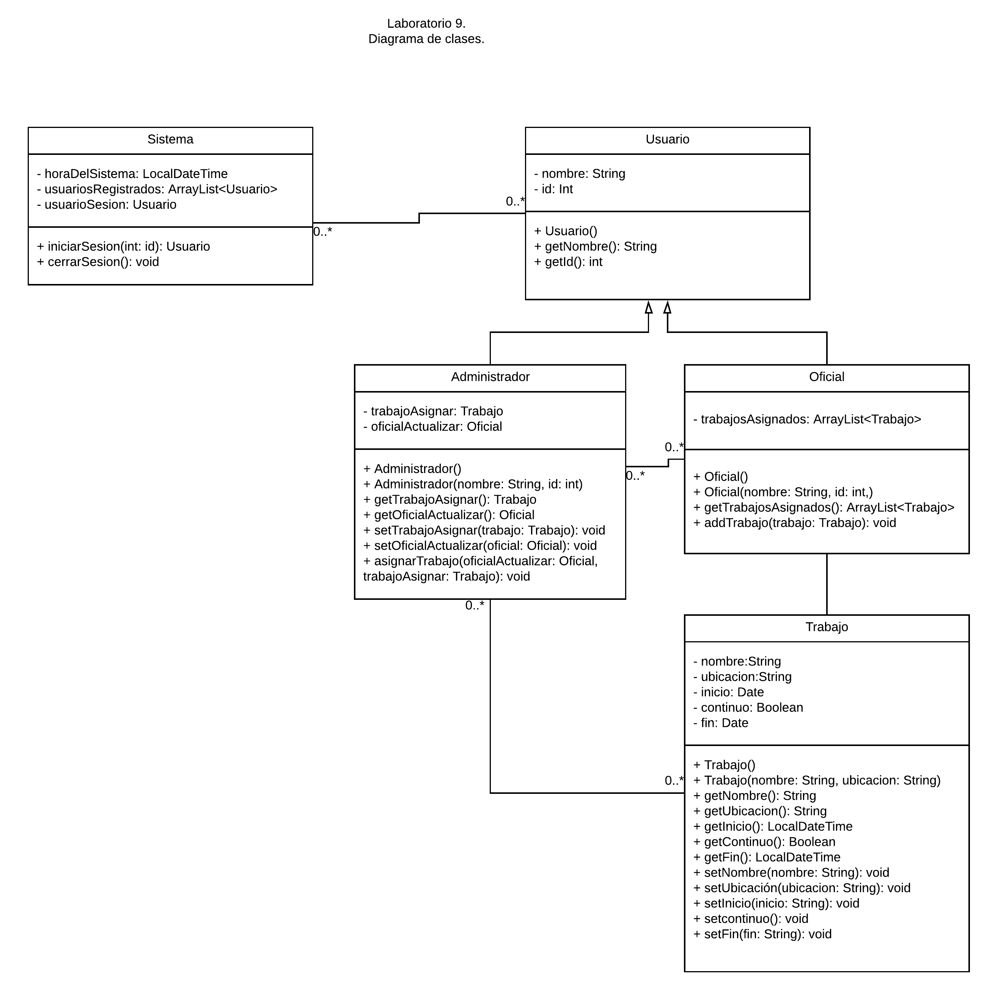
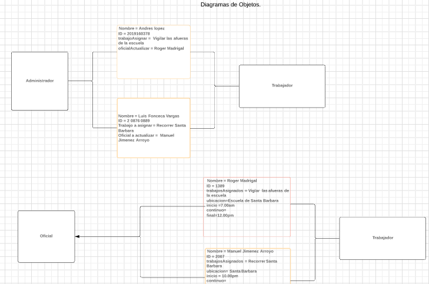

# POO_Lab9
Curso POO  - Lab 9  
Enunciado

## Enunciado:
```
Sistema de Información Policial: El sistema ayuda a los oficiales de la Policía Municipal de Alajuela a llevar registro del trabajo al que están asignados. Los oficiales pueden estar asignados a investigar casos particulares, a patrullar distintas áreas o a atender a eventos particulares como juicios. Algunos trabajos son asignaciones regulares y continuas, mientras que otras tienen se asignan por periodos particulares de tiempo El sistema de
información es actualizado por el administrador de logística y cada oficial puede acceder a sus propios trabajos asignados.
```

## Para modelar el sistema anterior:
```
a. Realice un diagrama de clases.
b. Realice un diagrama de objetos o instancias.
c. Utilice ambos diagramas para escribir el sistema en Java.
```

## Aspectos Administrativos
```
1. Límite para la entrega de la asignación: Martes 8 de octubre a las 3pm.
2. Plataforma de revisión: repositorio de código (incluir imágenes de diagramas)
```

## Este Lab fue grupal así que las horas de modificación corresponden a las horas de modificación del repositorio del compañero Steven, miembro de mi grupo de trabajo

## Fecha de modificacion de los archivos de este lab



## Diagrama de Clases


## Diagrama de Objetos

