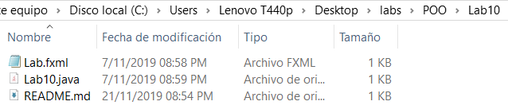

# POO_Lab10
Curso POO  - Lab 10
Enunciado

## Enunciado:
```
Se espera que los estudiantes
- Investigar acerca de las herramientas disponibles en JavaFX.
- Instalar y configurar JavaFX en el propio ambiente de desarrollo.
- Crear un pequeño programa de prueba en el que se muestren
```

## Aspectos Administrativos
```
1. Límite para la entrega de la asignación: Martes 8 de octubre a las 3pm.
2. Plataforma de revisión: repositorio de código (incluir imágenes de diagramas)
```
## Fecha de modificacion de los archivos de este lab
